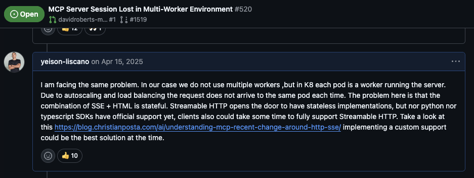

Model context protocol have become the standard to grant AI agent access to
external resources. It defines methods and the format to use in RCPJson messages
to access, and trigger the execution of a function (a.k.a tool) or instructions
(a.k.a prompts).

I have working on mcp implementation and here I will share the challenges I
faced.

## First versions of protocol were stateful

[Github Discussion Link](https://github.com/modelcontextprotocol/python-sdk/issues/520#issuecomment-2808158583)

The solution I implemented was writing a custom transport that does not care
about session, using standard HTTP request-responses. Here is the [package](https://pypi.org/project/http-mcp/)
I created for doing so.

### Fail vs Teach the AI agent

The implementation I had wrote used pydantic to validate the input provided by
the LLM, any mismatch on types or any error on inputs validation will cause an
error, so instead of returning an error when calling the tool I returned a
error message with feedback of because the inputs are invalid.

### How to expose tool depending on the context

I wanted some of the tools to be public, that is I wanted granted
access to a set of tools without requiring authentication.
Here I use starlette scopes and required scope attributes on
tools.

### Some tool to be executed could required authorization verification

Even if a tool is exposed it does not necessary means that the tool
could be used in all possible ways. Example: A tool that allows
access to a list of resources could need to identify the role of
the user being replaced by the AI agent using the tool .
